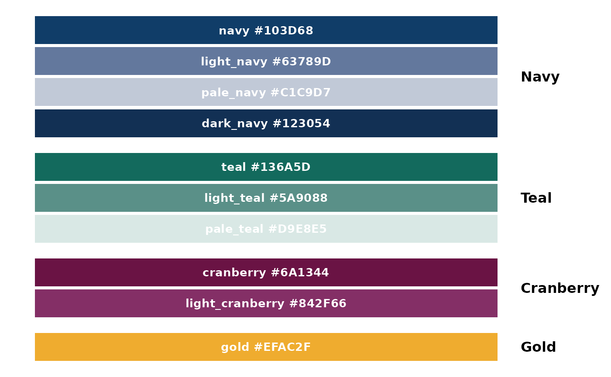
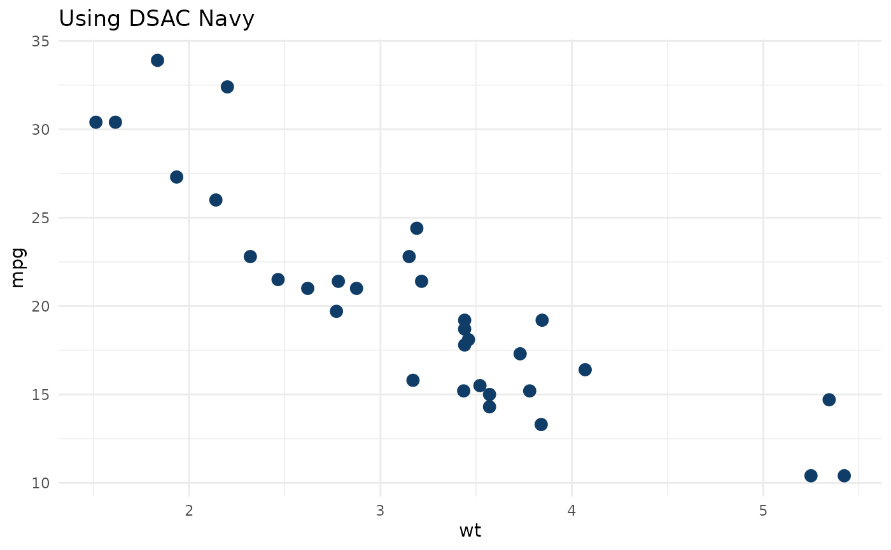
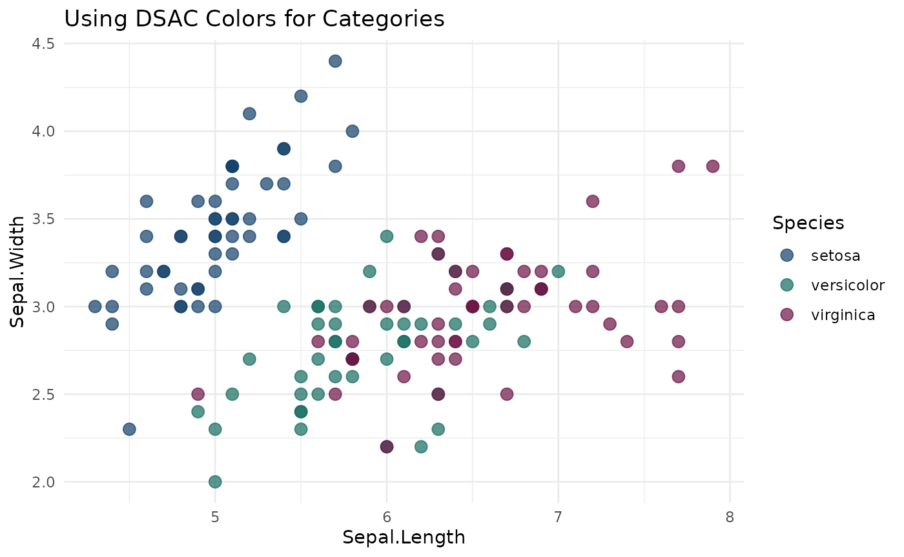

# DSAC Color Palette

## Introduction

This package includes the official Digital Service at CMS (DSAC) color
palette for use in visualizations. These colors are used internally by
package functions and are also available for creating custom plots that
maintain visual consistency with DSAC branding.

``` r

library(emmytics)
library(ggplot2)
library(dplyr)
library(tidyr)
library(tibble)
library(stringr)
```

## Available Colors

The DSAC palette includes 10 colors organized into four main color
families:



## Color Families

Navy and Teal are the primary colors of the DSAC brand. If you need a
tint for objects or shapes, use Light Navy or Light Teal. Read the text
usage guidelines before using tints as text colors to ensure you meet
text contrast accessibility standards.

Use the primary colors first before using secondary colors.

Cranberry and Gold are secondary colors of the DSAC brand. If you need a
tint for objects or shapes, use Light Cranberry. Read the text usage
guidelines before using tints as text colors. Do not use Gold for text
or information-bearing objects.

Use secondary colors when you need more than the two primary colors like
in charts or diagrams.

**Primary Colors**

- dsac_navy \#103D68
- dsac_teal \#136A5D

**Secondary colors**

- dsac_cranberry \#6A1344
- dsac_gold \#EFAC2F

**Tints/Shades**

- dsac_light_navy \#63789D
- dsac_pale_navy \#C1C9D7
- dsac_dark_navy \#123054
- dsac_light_teal \#5A9088
- dsac_pale_teal \#D9E8E5
- dsac_light_cranberry \#842F66

## Usage

### Using Individual Colors

Each color is available as a named object:

``` r

# Use individual color objects
ggplot(mtcars, aes(x = wt, y = mpg)) +
  geom_point(color = dsac_navy, size = 3) +
  theme_minimal() +
  labs(title = "Using DSAC Navy")
```



### Using the Color Vector

Access all colors through the dsac_colors vector:

``` r

# Access specific colors by name
dsac_colors["teal"]
#>      teal 
#> "#136A5D"
dsac_colors["gold"] %>% unname()
#> [1] "#EFAC2F"
```

``` r

# Print all available colors
dsac_colors
#>            navy            teal       cranberry            gold      light_navy 
#>       "#103D68"       "#136A5D"       "#6A1344"       "#EFAC2F"       "#63789D" 
#>       pale_navy      light_teal       pale_teal light_cranberry       dark_navy 
#>       "#C1C9D7"       "#5A9088"       "#D9E8E5"       "#842F66"       "#123054"
```

### Creating Color Palettes

Use DSAC colors to create custom discrete palettes:

``` r

# Example with 4 categories
ggplot(iris, aes(x = Sepal.Length, y = Sepal.Width, color = Species)) +
  geom_point(size = 3, alpha = 0.7) +
  scale_color_manual(values = c(dsac_navy, dsac_teal, dsac_cranberry)) +
  theme_minimal() +
  labs(title = "Using DSAC Colors for Categories")
```


